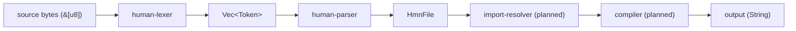

# Architecture

## Purpose

Human is a configuration and prompting language for AI.
Files end in `.hmn` and define agent behavior: persona, tone, constraints, context, instructions.
The compiler reads `.hmn` files and produces a resolved prompt or configuration object suitable for passing to a model.
Human is not a general-purpose programming language.
It has no loops, no runtime, no conditionals.
Its closest relatives are `.gitignore`, `Dockerfile`, `nginx.conf`, TOML, and shell scripts.

## Pipeline

```
source bytes ──► lexer ──► tokens ──► parser ──► AST ──► [import resolver] ──► [compiler] ──► output
   &[u8]        human-     Vec<       human-     HmnFile
                lexer      Token>     parser
```

Each stage is a separate Rust crate.
Brackets indicate unbuilt stages.
Each stage consumes the output of the previous stage and produces a new data structure.
No stage modifies its input.



## Crates

### human-lexer

Lexical analysis.
Accepts raw bytes, produces a token stream or errors.

- **Input:** `&[u8]`
- **Output:** `Result<Vec<Token<'a>>, Vec<LexError>>`
- **Error type:** `LexError` (`lexer/src/error.rs`)
- **Owns:** Token definitions, keyword table, span model, indentation logic, modal text capture.
- **Does not own:** AST construction, file I/O, path resolution.
- **Source:** `lexer/src/`
- **Detail:** [lexer.md](lexer.md)

### human-parser

Syntactic analysis.
Accepts a token slice, produces an AST or errors.

- **Input:** `&[Token<'a>]`
- **Output:** `Result<HmnFile, Vec<ParseError>>`
- **Error type:** `ParseError` (`parser/src/error.rs`)
- **Owns:** AST types (`HmnFile`, `AgentDecl`, `ConstraintsBlock`, `FlowBlock`, `TestBlock`, etc.), parse rules, error recovery.
- **Does not own:** Tokenization, import resolution, code generation.
- **Depends on:** `human-lexer` (path dependency `../lexer`)
- **Source:** `parser/src/`
- **Detail:** [parser.md](parser.md)

### import-resolver (planned)

Not yet implemented.
Will accept an `HmnFile` and the filesystem, resolve `IMPORT` directives, detect circular dependencies, and produce a dependency-ordered resolved file.

- **Detail:** [import-resolver.md](import-resolver.md)

### compiler (planned)

Not yet implemented.
Will accept a resolved AST and emit a final plain-text prompt or JSON configuration.

### cli (planned)

Not yet implemented.
Will orchestrate all stages: read files, lex, parse, resolve imports, compile, write output.
Commands: `human validate`, `human compile`, `human run`, `human init`.

## Data Flow

What crosses crate boundaries:

- **Lexer → Parser:** `Vec<Token<'a>>` where `'a` borrows the original `&[u8]` source.
  The parser borrows this token slice as `&[Token<'a>]`.
- **Parser → downstream:** `HmnFile` which owns all its strings (`.to_string()` at parse time).
  No lifetime parameter on `HmnFile`.
- **Errors:** Each stage returns its own `Vec<ErrorType>`.
  Errors do not cross crate boundaries except through `Result`.

Lifetimes:

- The lexer borrows source bytes (`'a`).
  `Token<'a>` contains `TokenKind<'a>` which borrows string slices from the source.
- The parser borrows the token slice (`'a`).
  AST nodes own their strings -- no lifetime leaks into the AST.
- No shared mutable state between stages.

## Error Model

Each crate defines its own error type.
Errors are collected in a `Vec`, not thrown or panicked.

- `LexError`: carries `line: u32`, `col: u16`, `message: String`.
- `ParseError`: carries `span: Span`, `message: String`.

Both support `display_with_file(filename)` producing the format:

```
file.hmn:12:4: error: unexpected token '@'
```

`MAX_ERRORS` (10) caps error accumulation per stage.
When the cap is reached, the stage stops processing and returns what it has.

Silent on success.
No output means no errors.

## Invariants

These hold across the entire system:

- All input is ASCII-only.
  The lexer validates this before tokenization.
  No subsequent stage re-validates.
- The token stream always ends with `Eof`.
- Every `Indent` token has a matching `Dedent` (including drain at EOF).
- At most one `AGENT` declaration per file.
  The parser enforces this.
- `SYSTEM` requires a preceding `AGENT` declaration.
  The parser enforces this.
- Errors never cross crate boundaries except through `Result` return values.
- No stage modifies its input.

## Unbuilt Subsystems

These directories exist as placeholders.
No code has been written for them.

- **import-resolver/** -- Will resolve `IMPORT` directives: file paths (relative to the importing file) and package names.
  Will detect and reject circular imports.
  Not yet specified.
- **compiler/** -- Will walk the resolved AST and emit output.
  Output format (plain text, JSON, or both) not yet specified.
- **interpreter/** -- May not exist.
  If the compiler emits a final prompt, a separate interpreter may be unnecessary.
  Not yet specified.
- **cli/** -- Will wire all stages together behind a command-line interface.
  Not yet specified.
- **formal-grammar/** -- Will contain the canonical EBNF grammar.
  Not yet specified.
- **language-reference/** -- Will contain the official language specification.
  Not yet specified.

## File Organization

```
human/
  lexer/              Rust crate: human-lexer v0.1.0
    Cargo.toml
    src/
      lib.rs          Public API re-exports
      token.rs        Token, TokenKind, Keyword, Span
      lexer.rs        Lexer implementation
      error.rs        LexError
      tests.rs        Lexer tests
  parser/             Rust crate: human-parser v0.1.0
    Cargo.toml
    src/
      lib.rs          Public API re-exports
      types.rs        AST types (HmnFile, AgentDecl, etc.)
      parser.rs       Parser implementation
      error.rs        ParseError
      tests.rs        Parser tests
  compiler/           (empty placeholder)
  interpreter/        (empty placeholder)
  import-resolver/    (empty placeholder)
  cli/                (empty placeholder)
  formal-grammar/     (empty placeholder)
  language-reference/ (empty placeholder)
  docs/               Internal engineering documentation (this directory)
  temp/               Working notes, user-facing docs, prompts
```

No workspace `Cargo.toml` exists.
Each crate builds independently.
The parser depends on the lexer via a relative path dependency in its `Cargo.toml`.
